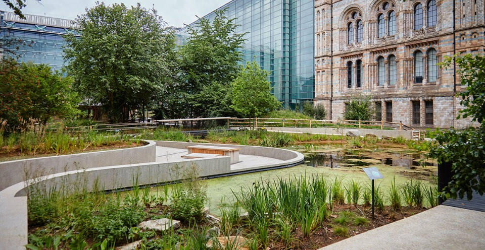
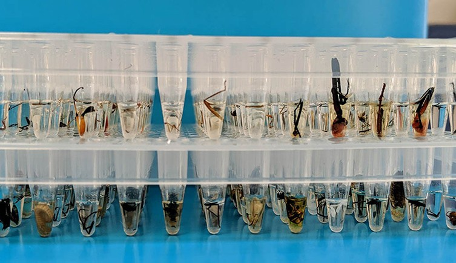
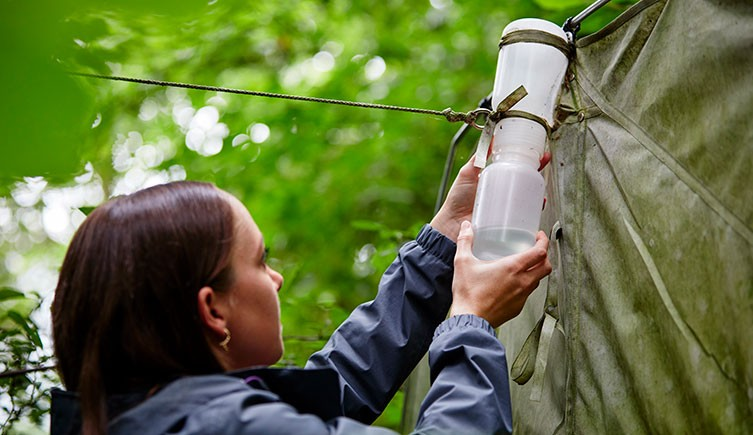

---
title: "Living Labs"
toc: false
---

::: {.living-labs-quote}
We are transforming the Museums' estates into public-facing ecological observatories.

:::

::: {.living-labs-quote}
We link collections-based science with real-time monitoring, community participation and nature recovery.

:::

::: {.living-labs-quote}
We create spaces where NHM staff and collaborators develop new methods to transform how natural history is observed, analysed and understood.

:::
